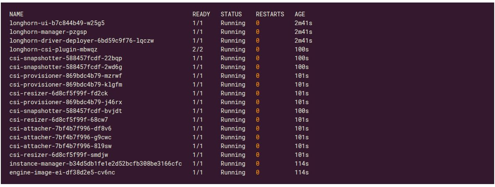
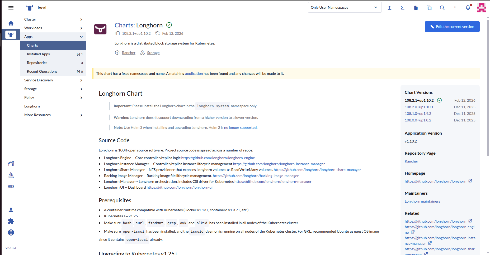
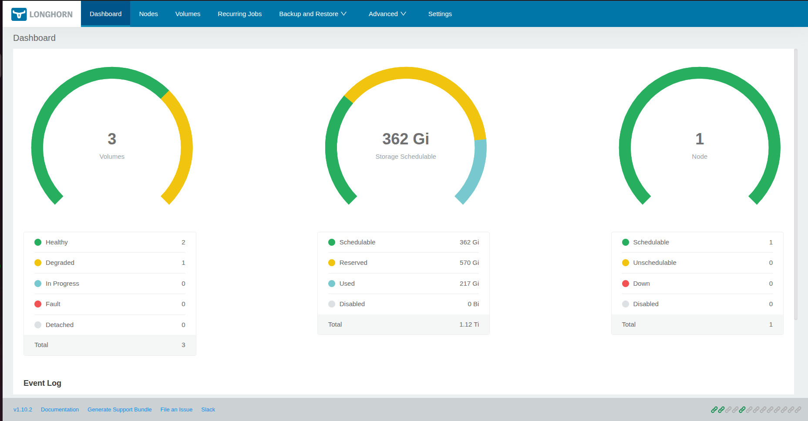
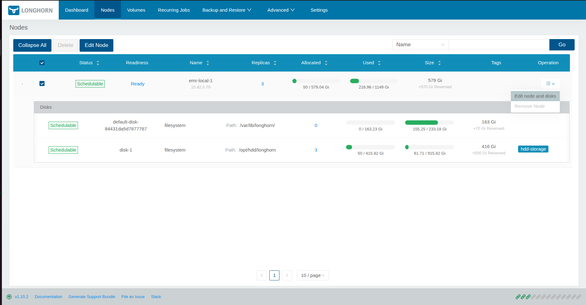
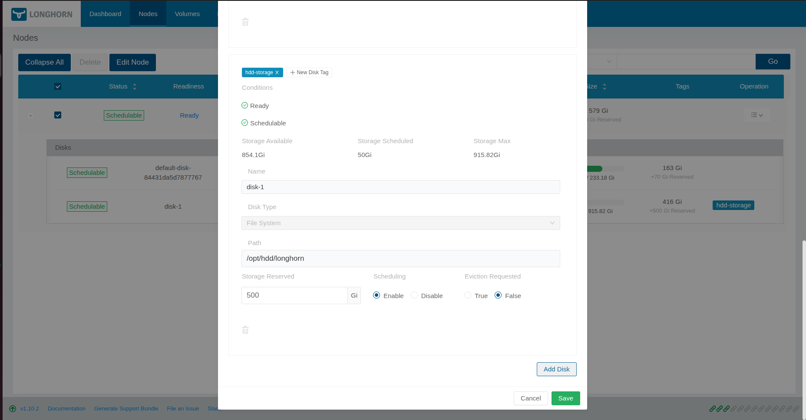
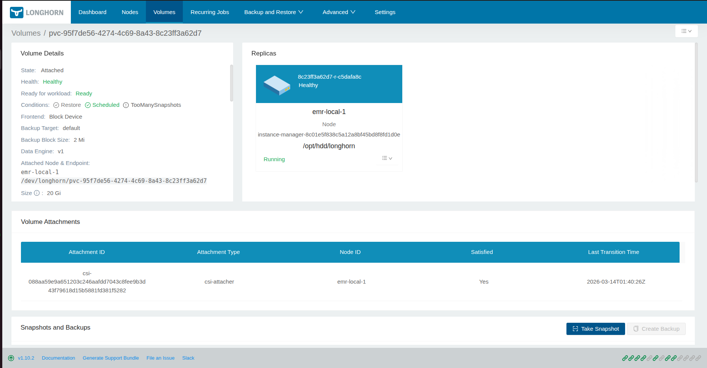
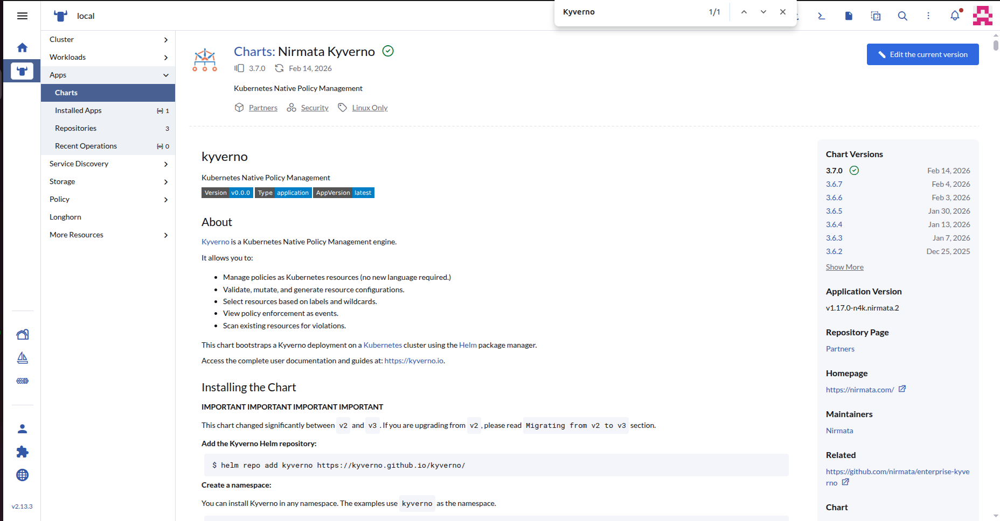
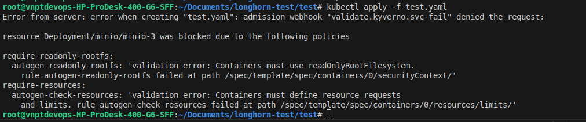

# Hướng dẫn cài đặt Longhorn & Kyverno

Cài đặt bộ Longhorn & Kyverno phục vụ k3s

## Phần 1: Cài đặt Longhorn

Longhorn là bộ quản lý tài nguyên lưu trữ trên các node (Các disk được mount trên các node). Cách cài đặt như sau:
### Yêu cầu tiên quyết
Cần cài đặt open-iscsi phục vụ kết nối tới bộ lưu trữ qua giao thức IP, bằng lệnh SCSI.
Cài thêm các package nfs-common, cryptsetup dmsetup...

Lưu ý: Đây là ví dụ về cách cài đặt trên Ubuntu; đối với các hệ điều hành khác, vui lòng tìm kiếm phương pháp cài đặt gói phù hợp.

``` sh
sudo apt update
sudo apt install -y nfs-common open-iscsi cryptsetup dmsetup
```

Tắt multipathd vì nó ảnh hưởng tới việc Longhorn assign volume.
``` sh
sudo systemctl stop multipathd
sudo systemctl disable multipathd
```

Check điều kiện trước khi cài ở từng node:

``` sh
# For AMD64 platform
curl -sSfL -o longhornctl https://github.com/longhorn/cli/releases/download/v1.11.0/longhornctl-linux-amd64
# For ARM platform
curl -sSfL -o longhornctl https://github.com/longhorn/cli/releases/download/v1.11.0/longhornctl-linux-arm64

chmod +x longhornctl
./longhornctl check preflight

```

Chạy lệnh này để bù thêm dependencies còn thiếu:
``` sh
./longhornctl install preflight
```

### 1.1 Cài đặt qua helm

``` sh
helm repo add longhorn https://charts.longhorn.io
helm repo update
helm install longhorn longhorn/longhorn --namespace longhorn-system --create-namespace --version 1.11.0
kubectl -n longhorn-system get pod
```

Kiểm tra kết quả



### 1.2 Cài đặt qua giao diện rancher (Ưu tiên nên dùng)

Tìm kiếm longhorn trong phần Apps/Charts và cài đặt theo mặc định:



### Vào phần giao diện sau khi cài đặt thành công



### 2.1 Bổ sung đĩa vào node, test thử các ví dụ

Vào setting của node, thêm đĩa đựa trên mount filesystem (Yêu cầu mount đĩa vào vị trí cố định, cấp quyền. Thao tác cần save để tự động mỗi khi node khởi động), đánh label cho đĩa.





Ví dụ sử dụng disk hdd với minio, theo kịch bản dưới đây:

Tạo storageClass, target vào label đĩa:

``` yaml
apiVersion: storage.k8s.io/v1
kind: StorageClass
metadata:
  name: longhorn-hdd
provisioner: driver.longhorn.io
parameters:
  dataEngine: "v1"
  numberOfReplicas: "1"
  fsType: "ext4"
  diskSelector: "hdd-storage"
  staleReplicaTimeout: "30"
reclaimPolicy: Delete
volumeBindingMode: Immediate
allowVolumeExpansion: true
```

Tạo pvc:

``` yaml
apiVersion: v1
kind: PersistentVolumeClaim
metadata:
  name: minio-data-2
  namespace: minio
spec:
  accessModes:
    - ReadWriteOnce
  storageClassName: longhorn-hdd
  resources:
    requests:
      storage: 10Gi
```

Chạy deployment, sử dụng pvc vừa tạo:

``` yaml
apiVersion: apps/v1
kind: Deployment
metadata:
  name: minio
  namespace: minio
spec:
  replicas: 1
  selector:
    matchLabels:
      app: minio
  template:
    metadata:
      labels:
        app: minio
    spec:
      containers:
      - name: minio
        image: minio/minio:latest
        args:
          - server
          - /data
          - --console-address
          - ":9001"
        env:
        - name: MINIO_ROOT_USER
          value: "admin"
        - name: MINIO_ROOT_PASSWORD
          value: "admin123456"
        ports:
        - containerPort: 9000
        - containerPort: 9001
        volumeMounts:
        - name: data
          mountPath: /data
      volumes:
      - name: data
        persistentVolumeClaim:
          claimName: minio-data
```

Bước 4: Kiểm tra kết quả volume vừa tạo trên Longhorn UI:




## Phần 2: Cài đặt Kyverno

Kyverno phục vụ set các rule tiêu chuẩn cho các deployment, demonset,... phục vụ chuẩn hóa workload của k3s.

### 2.1 Cài đặt qua helm

``` sh
helm repo add kyverno https://kyverno.github.io/kyverno/
helm repo update

# Sử dụng cho cài đặt cơ bản 
helm install kyverno kyverno/kyverno -n kyverno --create-namespace

# Sử dụng cho cài đặt nâng cao 
helm install kyverno kyverno/kyverno -n kyverno --create-namespace \
--set admissionController.replicas=3 \
--set backgroundController.replicas=2 \
--set cleanupController.replicas=2 \
--set reportsController.replicas=2
```

### 2.2 Cài đặt qua giao diện rancher (Ưu tiên nên dùng)

Tìm kiếm Kyverno trong phần Apps/Charts và cài đặt theo mặc định:



### Một vài case studies với Kyverno

Yêu cầu sử dụng read-only cho file system của container:

``` yaml
apiVersion: kyverno.io/v1
kind: ClusterPolicy
metadata:
  name: require-readonly-rootfs
spec:
  validationFailureAction: Enforce # Yeu cau bat buoc
  rules:
    - name: readonly-rootfs
      match:
        resources:
          kinds:
            - Pod
      validate:
        # Tin nhan tra ve neu vi pham
        message: "Containers must use readOnlyRootFilesystem."
        # Patern can phai tuan thu
        pattern:
          spec:
            containers:
              - securityContext:
                  readOnlyRootFilesystem: true
```

Yêu cầu phải đặt trước tài nguyên cho container:

``` yaml
apiVersion: kyverno.io/v1
kind: ClusterPolicy
metadata:
  name: require-resources
spec:
  validationFailureAction: Enforce
  background: true
  rules:
    - name: check-resources
      match:
        resources:
          kinds:
            - Pod
      validate:
        message: "Containers must define resource requests and limits."
        pattern:
          spec:
            containers:
              - resources:
                  requests:
                    cpu: "?*"
                    memory: "?*"
                  limits:
                    cpu: "?*"
                    memory: "?*"
```

Ví dụ về trường hợp vi phạm:

